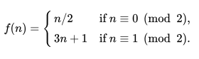

# Zadanie
1. Stwórz bibliotekę w języku C wystawiającą klientowi następujące dwie funkcje:
    1. `int collatz_conjecture(int input)` - funkcja realizująca regułę Collatza postaci
        

    Funkcja ta przyjmuje jedną liczbę typu całkowitego. Jeżeli jest ona parzysta, podzieli ją przez 2 i zwróci wynik. Jeżeli jest nieparzysta, pomnoży ją przez 3 i doda 1, a następnie zwróci wynik.
    
    2. `int test_collatz_convergence(int input, int max_iter)` - funkcja sprawdzająca po ilu wywołaniach `collatz_conjecture` zbiega się do ‘1’. Powinna ona wywoływać powyższą funkcję tyle razy (ale nie więcej), ile wynika z parametru `max_iter`, i porównać otrzymany w rezultacie wynik z ‘1’. W celu ochrony przed zbyt długim zapętleniem się funkcji drugi parametr stanowi górną granicę liczby iteracji. W przypadku gdy funkcja wykona maksymalną ilość iteracji i nie znajdzie wyniku ‘1’, wtedy z
